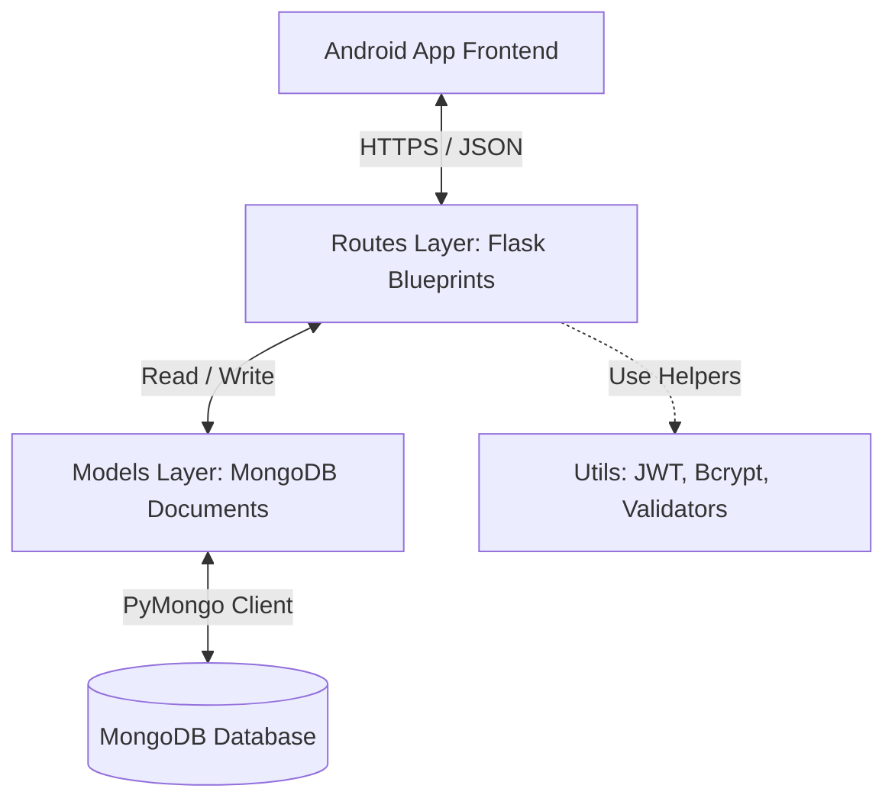

# MediCare+ Backend Documentation & Technical Reference

This document serves as a living project log and technical reference for the MediCare+ backend application. It details the system architecture, database design, API specifications, and setup instructions.

---

## 1. Backend Overview

### Purpose
The MediCare+ backend is a RESTful API server designed to power the MediCare+ Android application. It manages user credentials, patient and doctor profiles, medication tracking and logging, doctor appointments, and support utility services.

### Framework & Language
* **Language**: Python 3.x
* **Web Framework**: [Flask](https://flask.palletsprojects.com/) (version 3.1.3)
* **CORS Management**: `flask-cors` to enable safe origin cross-sharing with the mobile client.
* **Authentication**: Token-based security using JSON Web Tokens (JWT) handled via `Flask-JWT-Extended` and `PyJWT`.

### Overall Architecture
The backend follows a **Modular Route-Model-Service** architecture:
* **Entry Point (`app.py`)**: Boots the server, loads configurations, and registers application blueprints (routes).
* **Routes (`routes/`)**: Receives HTTP requests, executes route-specific logic, queries database models, and responds with standard JSON payloads.
* **Models (`models/`)**: Defines structural specifications and schema rules for MongoDB documents, ensuring clean data isolation.
* **Database Connection (`database/`)**: Connects to the MongoDB instance and exposes the database client reference.
* **Utilities (`utils/`)**: Encapsulates common routines like password hashing, JWT signing, and request body schema validation.



### Frontend ↔ Backend Communication
Communication is established entirely using REST API standards. The frontend Android application makes HTTP requests (POST, GET, PUT, DELETE) with `application/json` payloads and receives JSON-formatted responses. All protected routes require a JWT authorization token passed in the `Authorization: Bearer <token>` header.

### MongoDB Usage
MongoDB is used as the document-oriented database. The backend uses the official [PyMongo](https://pymongo.readthedocs.io/) driver to connect to the database, query collections, and execute CRUD actions. Due to the dynamic schema nature of MongoDB, the validation rules and default value definitions are enforced programmatically in the models layer before persistence.

---

## 2. Project Structure

The `Medicare-Backend` workspace is organized as follows:

```text
Medicare-Backend/
├── database/
│   └── mongo.py         # MongoDB connection initialization and helper references
├── models/
│   ├── user.py          # Core user authentication schema and business logic
│   ├── doctor.py        # Doctor profile details and schedule schemas
│   └── patient.py       # Patient profile details and accessibility settings schemas
├── routes/
│   ├── appointment.py   # Appointment scheduling and status update endpoints
│   ├── auth.py          # Authentication, registration, and token validation endpoints
│   ├── doctor.py        # Doctor lookup, list retrieval, and profile editing endpoints
│   ├── medicine.py      # Medication schedule CRUD and log reporting endpoints
│   └── patient.py       # Patient profile view and update endpoints
├── utils/
│   ├── jwt_handler.py   # Helper routines to issue and inspect JWT tokens
│   ├── password.py      # Security helper for Bcrypt password hashing/checking
│   └── validators.py    # Request parameter formatting and type validation helpers
├── .env                 # Local environment secret variables (gitignored)
├── .gitignore           # Specifies files ignored by the Git VCS
├── app.py               # Main Flask application bootstrapper and routing hook
├── config.py            # Settings loader parsing values from environment variables
└── requirements.txt     # Python external package dependencies manifest
```

---

## 3. MongoDB Database

* **Database Name**: `medicare_db` (configurable in `.env`)
* **Collections**: `users`, `patients`, `doctors`, `medicines`, `appointments`

### Collection: `users`
* **Purpose**: Stores core credentials, password verification details, and system roles.
* **Fields**:
  * `_id` (`ObjectId`): Auto-generated unique identifier.
  * `email` (`string`): Unique user email address. *Required*.
  * `password_hash` (`string`): Secure Bcrypt password hash. *Required*.
  * `role` (`string`): Specifies user type. Must be either `"patient"` or `"doctor"`. *Required*.
  * `created_at` (`datetime`): Timestamp of account registration.
  * `updated_at` (`datetime`): Timestamp of last account modification.
* **Indexes**: Unique index on `email`.

### Collection: `patients`
* **Purpose**: Stores patient profile information and custom accessibility preferences.
* **Fields**:
  * `_id` (`ObjectId`): References the user's primary key in the `users` collection. *Required*.
  * `name` (`string`): Full name of the patient. *Required*.
  * `blood_group` (`string`): Blood group label (e.g., `"A+"`, `"O-"`). *Optional*.
  * `emergency_contact` (`string`): Contact phone number. *Optional*.
  * `accessibility_settings` (`object`): Patient configuration settings. *Required*.
    * `contrast_mode` (`boolean`): High-contrast layout switch. (Default: `false`).
    * `voice_input` (`boolean`): Voice control enable switch. (Default: `false`).
    * `haptic_feedback` (`boolean`): Touch haptics enable switch. (Default: `false`).
  * `created_at` (`datetime`): Creation timestamp.
  * `updated_at` (`datetime`): Timestamp of last profile update.

### Collection: `doctors`
* **Purpose**: Stores clinical specialization details, contacts, and availability rules.
* **Fields**:
  * `_id` (`ObjectId`): References the user's primary key in the `users` collection. *Required*.
  * `name` (`string`): Doctor's full name. *Required*.
  * `specialization` (`string`): Area of expertise. *Required*.
  * `clinic_address` (`string`): Address location of the clinic. *Optional*.
  * `phone` (`string`): Clinic contact number. *Optional*.
  * `schedule` (`array` of `objects`): Weekly time slot rules. *Optional*.
    * `day` (`string`): Day of the week (e.g. `"Monday"`).
    * `start_time` (`string`): Time format `"HH:MM"`.
    * `end_time` (`string`): Time format `"HH:MM"`.
  * `created_at` (`datetime`): Creation timestamp.
  * `updated_at` (`datetime`): Timestamp of last profile update.

### Collection: `medicines`
* **Purpose**: Stores patient medication records, dosage schedules, and historical logging compliance.
* **Fields**:
  * `_id` (`ObjectId`): Auto-generated unique identifier.
  * `patient_id` (`ObjectId`): References the patient owner from the `patients` collection. *Required*.
  * `name` (`string`): Brand or generic name of the medication. *Required*.
  * `type` (`string`): Dosage format. Must be one of: `"tablet"`, `"capsule"`, `"syrup"`, `"injection"`. *Required*.
  * `dosage` (`string`): Measurement string (e.g., `"500mg"`, `"1 capsule"`). *Required*.
  * `frequency` (`string`): Schedule frequency. Must be one of: `"daily"`, `"weekly"`, `"as_needed"`. *Required*.
  * `start_date` (`string`): Date string format `"YYYY-MM-DD"`. *Required*.
  * `end_date` (`string`): Date string format `"YYYY-MM-DD"`. *Required*.
  * `reminder_times` (`array` of `strings`): Daily alarm times in `"HH:MM"` format (e.g., `["08:00", "20:00"]`). *Required*.
  * `logs` (`array` of `objects`): History log tracks patient compliance.
    * `date` (`string`): Log date in `"YYYY-MM-DD"` format.
    * `time` (`string`): Log time in `"HH:MM"` format.
    * `status` (`string`): Compliance status. Must be: `"taken"`, `"snoozed"`, `"skipped"`, `"missed"`.
  * `created_at` (`datetime`): Creation timestamp.
  * `updated_at` (`datetime`): Last modified timestamp.
* **Indexes**: Compound index on `patient_id` and `start_date`.

### Collection: `appointments`
* **Purpose**: Tracks structured calendar bookings between patients and doctors.
* **Fields**:
  * `_id` (`ObjectId`): Auto-generated unique identifier.
  * `patient_id` (`ObjectId`): References the booking patient. *Required*.
  * `doctor_id` (`ObjectId`): References the attending physician. *Required*.
  * `date_time` (`datetime`): Standard ISO format date and time. *Required*.
  * `status` (`string`): Booking status. Must be: `"scheduled"`, `"completed"`, `"cancelled"`. *Required*.
  * `notes` (`string`): Summary of symptoms or treatment requests. *Optional*.
  * `created_at` (`datetime`): Creation timestamp.
  * `updated_at` (`datetime`): Last modified timestamp.

---

## 4. API Documentation

### Auth Endpoints

#### `POST /api/auth/register`
* **Purpose**: Registers a new patient or doctor account and initializes their empty profile structure.
* **Authentication**: Not required.
* **Request Body**:
  ```json
  {
      "email": "user@example.com",
      "password": "SecurePassword123",
      "role": "patient",
      "name": "Jane Doe"
  }
  ```
* **Response (201 Created)**:
  ```json
  {
      "success": true,
      "message": "User registered successfully",
      "user_id": "64d8bc79e6f3ab4f2c98d63a"
  }
  ```
* **Errors**:
  * `400 Bad Request`: Email already in use or missing parameters.

#### `POST /api/auth/login`
* **Purpose**: Validates credentials and returns JWT access/refresh tokens.
* **Authentication**: Not required.
* **Request Body**:
  ```json
  {
      "email": "user@example.com",
      "password": "SecurePassword123"
  }
  ```
* **Response (200 OK)**:
  ```json
  {
      "success": true,
      "access_token": "eyJhbGciOi...",
      "refresh_token": "eyJhbGciOi...",
      "role": "patient",
      "user_id": "64d8bc79e6f3ab4f2c98d63a"
  }
  ```
* **Errors**:
  * `401 Unauthorized`: Invalid email or password.

#### `POST /api/auth/logout`
* **Purpose**: Invalidate JWT tokens (revocation list).
* **Authentication**: Required.
* **Request**: Empty payload.
* **Response (200 OK)**:
  ```json
  {
      "success": true,
      "message": "Successfully logged out"
  }
  ```

#### `GET /api/auth/me`
* **Purpose**: Returns authentication state and core user roles.
* **Authentication**: Required.
* **Response (200 OK)**:
  ```json
  {
      "success": true,
      "user_id": "64d8bc79e6f3ab4f2c98d63a",
      "email": "user@example.com",
      "role": "patient"
  }
  ```

---

### Patient Endpoints

#### `GET /api/patients/profile`
* **Purpose**: Retrieves details and accessibility configurations for the current authenticated patient.
* **Authentication**: Required (Patient role).
* **Response (200 OK)**:
  ```json
  {
      "success": true,
      "profile": {
          "id": "64d8bc79e6f3ab4f2c98d63a",
          "name": "Jane Doe",
          "blood_group": "O-",
          "emergency_contact": "+15555551234",
          "accessibility_settings": {
              "contrast_mode": false,
              "voice_input": true,
              "haptic_feedback": false
          }
      }
  }
  ```

#### `PUT /api/patients/profile`
* **Purpose**: Modifies patient demographics and accessibility toggles.
* **Authentication**: Required (Patient role).
* **Request Body**:
  ```json
  {
      "name": "Jane Doe",
      "blood_group": "O-",
      "emergency_contact": "+15555551234",
      "accessibility_settings": {
          "contrast_mode": true,
          "voice_input": true,
          "haptic_feedback": true
      }
  }
  ```
* **Response (200 OK)**:
  ```json
  {
      "success": true,
      "message": "Profile updated successfully"
  }
  ```

---

### Doctor Endpoints

#### `GET /api/doctors`
* **Purpose**: Lists doctors. Supports searching and specialty filters.
* **Authentication**: Required.
* **Query Parameters**:
  * `specialization` (string, optional)
* **Response (200 OK)**:
  ```json
  {
      "success": true,
      "doctors": [
          {
              "id": "64d8bc98e6f3ab4f2c98d63b",
              "name": "Dr. Smith",
              "specialization": "Cardiology",
              "clinic_address": "456 Medical Way"
          }
      ]
  }
  ```

#### `GET /api/doctors/<id>`
* **Purpose**: Retrieves a specific doctor's profile and schedule availability.
* **Authentication**: Required.
* **Response (200 OK)**:
  ```json
  {
      "success": true,
      "doctor": {
          "id": "64d8bc98e6f3ab4f2c98d63b",
          "name": "Dr. Smith",
          "specialization": "Cardiology",
          "clinic_address": "456 Medical Way",
          "phone": "+15551112222",
          "schedule": [
              {
                  "day": "Monday",
                  "start_time": "09:00",
                  "end_time": "17:00"
              }
          ]
      }
  }
  ```

---

### Medicine Endpoints

#### `GET /api/medicines`
* **Purpose**: Retrieves the medicine schedule list for the logged-in patient.
* **Authentication**: Required (Patient role).
* **Response (200 OK)**:
  ```json
  {
      "success": true,
      "medicines": [
          {
              "id": "64d8bcbfe6f3ab4f2c98d63c",
              "name": "Ibuprofen",
              "type": "tablet",
              "dosage": "400mg",
              "frequency": "daily",
              "start_date": "2026-08-10",
              "end_date": "2026-08-20",
              "reminder_times": ["08:00", "20:00"],
              "logs": []
          }
      ]
  }
  ```

#### `POST /api/medicines`
* **Purpose**: Saves a new medication entry.
* **Authentication**: Required (Patient role).
* **Request Body**:
  ```json
  {
      "name": "Ibuprofen",
      "type": "tablet",
      "dosage": "400mg",
      "frequency": "daily",
      "start_date": "2026-08-10",
      "end_date": "2026-08-20",
      "reminder_times": ["08:00", "20:00"]
  }
  ```
* **Response (201 Created)**:
  ```json
  {
      "success": true,
      "message": "Medicine added successfully",
      "medicine_id": "64d8bcbfe6f3ab4f2c98d63c"
  }
  ```

#### `PUT /api/medicines/<id>`
* **Purpose**: Modifies an existing medication schedule entry.
* **Authentication**: Required (Patient role).
* **Request Body**: (Same structure as `POST /api/medicines`)
* **Response (200 OK)**:
  ```json
  {
      "success": true,
      "message": "Medicine updated successfully"
  }
  ```

#### `DELETE /api/medicines/<id>`
* **Purpose**: Deletes a medicine entry.
* **Authentication**: Required (Patient role).
* **Response (200 OK)**:
  ```json
  {
      "success": true,
      "message": "Medicine deleted successfully"
  }
  ```

#### `POST /api/medicines/<id>/log`
* **Purpose**: Records a compliance action taken against a reminder time trigger.
* **Authentication**: Required (Patient role).
* **Request Body**:
  ```json
  {
      "date": "2026-08-13",
      "time": "08:15",
      "status": "taken"
  }
  ```
* **Response (200 OK)**:
  ```json
  {
      "success": true,
      "message": "Compliance log recorded"
  }
  ```

---

### Appointment Endpoints

#### `GET /api/appointments`
* **Purpose**: Fetches scheduled calendar bookings. Patients see their doctor visits, doctors see their appointments.
* **Authentication**: Required.
* **Response (200 OK)**:
  ```json
  {
      "success": true,
      "appointments": [
          {
              "id": "64d8bccfe6f3ab4f2c98d63d",
              "patient_name": "Jane Doe",
              "doctor_name": "Dr. Smith",
              "date_time": "2026-08-15T14:30:00",
              "status": "scheduled",
              "notes": "Follow up consultation"
          }
      ]
  }
  ```

#### `POST /api/appointments`
* **Purpose**: Books a new appointment slot with a doctor.
* **Authentication**: Required (Patient role).
* **Request Body**:
  ```json
  {
      "doctor_id": "64d8bc98e6f3ab4f2c98d63b",
      "date_time": "2026-08-15T14:30:00",
      "notes": "Follow up consultation"
  }
  ```
* **Response (201 Created)**:
  ```json
  {
      "success": true,
      "message": "Appointment booked successfully",
      "appointment_id": "64d8bccfe6f3ab4f2c98d63d"
  }
  ```

#### `PUT /api/appointments/<id>`
* **Purpose**: Updates booking details or cancels an appointment slot.
* **Authentication**: Required.
* **Request Body**:
  ```json
  {
      "status": "cancelled",
      "notes": "Rescheduling needed"
  }
  ```
* **Response (200 OK)**:
  ```json
  {
      "success": true,
      "message": "Appointment updated successfully"
  }
  ```

---

## 5. Authentication & Authorization

### Authentication Flow
1. **Login**: User registers/logs in using standard email and password input.
2. **Token Issuance**: The backend verifies credentials using the `bcrypt` password verifier. On success, it issues a signed JWT access token (short lifetime) and refresh token (long lifetime).
3. **Client Storage**: The mobile app stores the tokens locally inside a secure storage interface (e.g. EncryptedSharedPreferences).
4. **API Requests**: The client app includes the JWT access token in the `Authorization: Bearer <access_token>` header on subsequent requests.
5. **Token Refresh**: When the access token expires (returning a `401 Unauthorized` token expired code), the client sends the refresh token to `/api/auth/refresh` to fetch a new access token without logging the user out.

### Password Security
Passwords are never stored in plain text. When a user registers, the password is processed in `utils/password.py` using `bcrypt.hashpw` with a automatically generated salt. Verification checks verify the submitted password against the stored database hash.

---

## 6. Frontend ↔ Backend Integration

The following mapping shows the integration points between screens in the Android application and the backend APIs:

```text
Login Screen
    ↓ Input Credentials
POST /api/auth/login
    ↓ If Validated, JWT Token Returned
Home Screen / Dashboard (Saves Token & Syncs Profiles)

--------------------------------------------------------------

Dashboard Home
    ↓ Fetches logs, schedule, and next upcoming alarm
GET /api/medicines
GET /api/appointments

--------------------------------------------------------------

Medicines Activity (Schedule Feed & Filters)
    ↓ Pulls full list of medications
GET /api/medicines
    ↓ Deletes items
DELETE /api/medicines/<id>

--------------------------------------------------------------

Add Medicine Form Activity
    ↓ Form submission
POST /api/medicines
    ↓ Edit existing form details
PUT /api/medicines/<id>

--------------------------------------------------------------

Reminder Alarm Overlay Screen
    ↓ Triggered at reminder times
    ↓ User clicks: Take / Snooze / Skip
POST /api/medicines/<id>/log

--------------------------------------------------------------

Profile & Settings Screen
    ↓ Loads demographics and accessibility state
GET /api/patients/profile
    ↓ Modifies preferences (contrast, haptic, text size)
PUT /api/patients/profile
    ↓ Confirms sign out action
POST /api/auth/logout (Local Token Cleared)
```

---

## 7. Environment Configuration

The backend loads config variables from a local `.env` file (which is gitignored). An example configuration template is provided in `.env.example`.

```bash
# Flask Server Config
FLASK_APP=app.py
FLASK_ENV=development
PORT=5000

# Security Key
JWT_SECRET_KEY=super-secret-jwt-signing-key-placeholder

# MongoDB Database Config
MONGO_URI=mongodb://localhost:27017/
MONGO_DB_NAME=medicare_db
```

*Note: Never commit actual keys, credentials, or DB passwords to source control.*

---

## 8. Setup & Running Instructions

### 1. Install Dependencies
Navigate into the backend project directory, set up a Python virtual environment, and install dependencies listed in `requirements.txt`:
```bash
cd Medicare-Backend
python -m venv venv
# Activate on Windows:
venv\Scripts\activate
# Activate on macOS/Linux:
source venv/bin/activate

pip install -r requirements.txt
```

### 2. Configure `.env`
Create a `.env` file in the `Medicare-Backend` root and populate it using placeholders (use values from environment configuration section):
```bash
cp .env.example .env   # Or create it manually
```

### 3. Start MongoDB
Ensure MongoDB is running locally on default port `27017` or update `MONGO_URI` in `.env` to point to a MongoDB Atlas cluster.
```bash
# If using MongoDB installed as a local system service (Windows):
net start MongoDB
```

### 4. Start the Backend
Execute the Flask server:
```bash
python app.py
```
By default, the server runs on `http://127.0.0.1:5000/`.

### 5. Start the Frontend
Open the `Medicare` directory in Android Studio. Ensure that compile SDK settings align, and compile or install on a physical test device/emulator:
```bash
cd ../Medicare
./gradlew assembleDebug
```

### 6. Run Tests
Execute the tests using Pytest inside the backend environment:
```bash
pytest
```

---

## 9. Testing

* **Test Framework**: `pytest`
* **Test Configurations**: In-memory database mocks or test database namespaces (`medicare_test_db`) are utilized to ensure testing isolation.
* **Test Coverage**:
  * **Auth Suite**: Covers client registration, login validation, token issuance, invalid credentials rejection, and access controls on protected endpoints.
  * **Profile Suite**: Validates patient metadata retrieval and updating accessibility parameters.
  * **Medicine Suite**: Validates medication creation, modification, scheduling calculations, and compliance log updates.
  * **Integration Flows**: Simulates end-to-end user actions (Register -> Login -> Add Medicine -> Log Compliance Action).

---

## 10. Implementation Changelog

### 2026-08-13

#### Added
* Initial directory skeleton structures for database connectivity (`database/mongo.py`), routing handlers (`routes/`), schemas (`models/`), and helper libraries (`utils/`).
* Created `BACKEND_DOCUMENTATION.md` to map out the technical reference architectures, API structures, database entities, and running steps.

#### Changed
* Project metadata configurations set up in `requirements.txt` and `.gitignore`.

---

## 11. Current Status

### Backend:
Skeleton Initialized (empty python files). No actual server routing or app configuration code has been written.

### MongoDB:
Database connection and model structures are planned. No connection logic in database/mongo.py or schemas in models/ are implemented.

### Authentication:
JWT flow and bcrypt hashing are planned in utils/ and routes/auth.py, but not yet implemented.

### Frontend Integration:
Not integrated. The Android app operates on local mock data and has no network capability or API calling layer implemented.

### Testing:
No unit or integration tests have been written. The testing environment is planned to use standard unittest or pytest.

### Known Issues:
* The backend application is entirely composed of empty placeholder files (0-byte skeletons) and cannot be executed yet.
* Frontend Android client does not have network client configurations (e.g. Retrofit or OkHttp) to connect to the backend.
